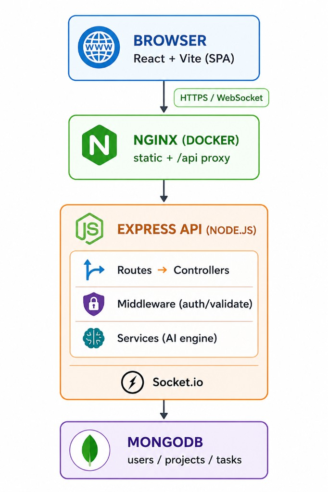

# TaskFlow AI

> An intelligent project management platform with explainable AI insights, real-time collaboration, and a Kanban workflow — built end-to-end with the MERN stack.

[](https://nodejs.org)
[](https://react.dev)
[](https://expressjs.com)
[](https://www.mongodb.com)
[](https://socket.io)
[](https://www.docker.com)
[](./LICENSE)

---

## Demo

> Replace the placeholders below with real screenshots / GIFs once the app is running. Recommended captures: Dashboard, Projects, Kanban Board, AI Assistant.

| Dashboard | Kanban Board |
| --- | --- |
| _Add `docs/screenshots/dashboard.png`_ | _Add `docs/screenshots/board.png`_ |

| AI Assistant | Login |
| --- | --- |
| _Add `docs/screenshots/ai.png`_ | _Add `docs/screenshots/login.png`_ |

Live demo: _Add deployment URL (Render / Railway / Fly.io) here_

---

## Why I Built This

I wanted a portfolio project that goes beyond a CRUD todo list and demonstrates the patterns I would use on a real product team:

- **End-to-end ownership** — data model, REST API, authentication, real-time layer, frontend state, deployment.
- **Explainable AI** — instead of hiding behind a black-box LLM, the AI scoring uses deterministic signals (due dates, priorities, workload, review queue) so the recommendations can be defended in code review.
- **Production-shaped backend** — JWT auth, role-aware access control, request validation, rate limiting, Helmet, and structured error handling.
- **Real-time UX** — Socket.io rooms scoped per project so the Kanban board updates without polling.
- **Resilient demo mode** — the frontend ships with fallback data clearly labeled as demo, so the app stays presentable even if the API is unreachable.

---

## Highlights

- React 18 + Vite frontend with Dashboard, Projects, Kanban Tasks board, and an AI Assistant page.
- Express + MongoDB backend with protected REST APIs and role-aware project/task access control.
- JWT authentication, bcrypt password hashing, Helmet, CORS, express-rate-limit, and express-validator.
- Real-time project/task events via Socket.io rooms (`project:<id>`).
- Explainable AI service:
  - `GET /api/ai/insights` scores delivery health, risky tasks, workload pressure, and next actions.
  - `POST /api/ai/suggest-tasks` turns a product goal into scoped task suggestions with priorities, estimates, and confidence.
- Docker Compose stack for MongoDB + API + Nginx-served client.
- Demo fallback data in the frontend, visibly labeled when the API is unavailable.

---

## Tech Stack

| Layer | Tools |
| --- | --- |
| Frontend | React 18, Vite, React Router, Zustand, Framer Motion, Recharts, Lucide, Axios, Socket.io Client, react-hot-toast |
| Backend | Node.js 18+, Express 4, MongoDB 7, Mongoose 8, JWT, bcryptjs, Socket.io 4, express-validator, express-rate-limit, Helmet, Morgan |
| DevOps | Docker, Docker Compose, Nginx, GitHub Actions |

---

## Architecture

<p align="center">
  
</p>

The browser talks to an Nginx container that serves the static React bundle and
reverse-proxies `/api` and `/socket.io` to the Express service. The API layer is
split into routes → controllers, with middleware for auth and validation and a
dedicated services layer (where the deterministic AI engine lives). Express
holds the Socket.io server that pushes project-scoped events back to the
browser. MongoDB stores users, projects, and tasks.

---

## Project Structure

```text
taskflow-ai/
├── client/                    # React + Vite frontend
│   ├── public/
│   ├── src/
│   │   ├── components/        # Shared layout / UI
│   │   ├── pages/             # Dashboard, Projects, Tasks, AI Assistant, Login, Register
│   │   ├── services/          # api.js, socket.js, demoData.js
│   │   ├── stores/            # Zustand stores (authStore)
│   │   └── styles/
│   ├── Dockerfile
│   └── nginx.conf
├── server/                    # Express backend
│   ├── config/                # Database connection
│   ├── controllers/           # Route handlers
│   ├── middleware/            # auth, validate, errorHandler
│   ├── models/                # Mongoose schemas
│   ├── routes/                # REST API endpoints
│   ├── services/              # AI insight / task-suggestion engine
│   ├── seed/                  # Demo data seeder
│   ├── __tests__/             # API tests
│   └── server.js
├── .github/workflows/         # CI pipeline
├── docker-compose.yml
└── package.json               # Workspace scripts
```

---

## Quick Start

### Prerequisites

- Node.js 18+
- MongoDB running locally (or Docker)
- npm 9+

### 1. Clone & install

```bash
git clone https://github.com/sinhtranMCS/taskflow-ai.git
cd taskflow-ai
npm run install:all
```

### 2. Configure environment

```bash
cp .env.example .env
# Edit .env and set JWT_SECRET to a strong random value
```

### 3. Seed demo data (optional but recommended)

```bash
cd server && npm run seed && cd ..
```

### 4. Run the stack

```bash
npm run dev
```

| Service | URL |
| --- | --- |
| Frontend (Vite) | http://localhost:5173 |
| Backend health | http://localhost:5000/api/health |

### Demo Credentials (after seeding)

```text
Email:    alex@taskflow.ai
Password: password123
```

> The Login page also has a **"View Demo Workspace"** button that loads the frontend with mocked data — handy for showing the UI without a running backend.

---

## Docker

Spin up MongoDB, the API, and the Nginx-served client with one command:

```bash
docker compose up --build
```

Frontend → http://localhost:3000 (Nginx proxies `/api` and `/socket.io` to the API container).

> Set `JWT_SECRET` in `.env` before running — Docker Compose will fail fast if it is missing.

---

## API Summary

| Method | Endpoint | Auth | Description |
| --- | --- | :---: | --- |
| POST | `/api/auth/register` | — | Create account |
| POST | `/api/auth/login` | — | Sign in |
| GET | `/api/auth/me` | ✓ | Current user |
| GET / POST | `/api/projects` | ✓ | List / create projects |
| GET / PUT / DELETE | `/api/projects/:id` | ✓ | Project detail / update / delete |
| POST | `/api/projects/:id/members` | ✓ | Add project member |
| GET / POST | `/api/tasks` | ✓ | List / create tasks |
| GET / PUT / DELETE | `/api/tasks/:id` | ✓ | Task detail / update / delete |
| PATCH | `/api/tasks/:id/status` | ✓ | Move task between Kanban columns |
| POST | `/api/tasks/:id/comments` | ✓ | Add task comment |
| GET | `/api/dashboard` | ✓ | Dashboard metrics |
| GET | `/api/ai/insights` | ✓ | AI delivery health and recommendations |
| POST | `/api/ai/suggest-tasks` | ✓ | AI task breakdown from a goal |
| GET | `/api/health` | — | Service health probe |

---

## Useful Scripts

```bash
npm run dev          # Run client + server concurrently
npm run build        # Production build of the frontend
npm start            # Start the API server only
npm test             # Run the API test suite
npm run docker:up    # docker compose up -d
npm run docker:down  # docker compose down
```

---

## Challenges & Learnings

A few interesting problems I worked through while building this:

1. **Designing an explainable AI layer.** Rather than calling an LLM and rendering its answer, I built a deterministic scoring engine (`server/services/aiService.js`). It combines due-date proximity, priority weights, assignee gaps, review-queue size, and per-member workload into a single health score with human-readable reasons. The trade-off: it cannot generalize like an LLM, but every recommendation is auditable and reproducible — exactly what a real PM tool needs.
2. **Project-scoped real-time updates.** Broadcasting every change to every client is wasteful and leaks data across projects. I scoped Socket.io rooms per project (`project:<id>`) and have the React board subscribe only to the projects currently visible. The server emits `task-created`, `task-updated`, `task-status-changed`, and `task-deleted` events that the board reconciles into local state without a full refetch.
3. **Server-side access control.** Hiding data on the client is not security. The middleware in `server/middleware/auth.js` validates the JWT, and every project / task controller checks ownership or membership before reading or mutating. Admins get a wider scope, regular users only see what they belong to.
4. **Resilient demo mode.** Interview demos fail in embarrassing ways — Wi-Fi drops, the API container takes a moment to boot, Mongo isn't seeded. The frontend falls back to demo data on API failure and shows a visible banner so the reviewer is not misled into thinking it is live data.
5. **One-command stack with Docker.** Three containers (Mongo, API, Nginx + client) wired together with a private bridge network, with `JWT_SECRET` enforced from the environment so the stack refuses to start with a missing secret.

---

## Roadmap

- [ ] Replace deterministic AI with optional OpenAI / local LLM fallback (keep deterministic path as the default)
- [ ] Drag-and-drop column ordering with persistence
- [ ] Task comments thread & @mentions
- [ ] E2E tests with Playwright
- [ ] Deploy to Render / Railway with a public demo URL

---

## License

[MIT](./LICENSE) © 2026 Tran Truong Sinh
